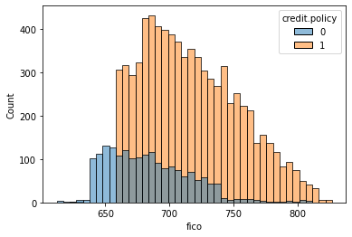
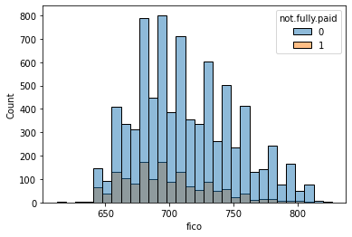
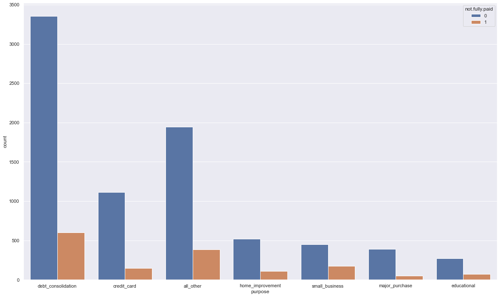
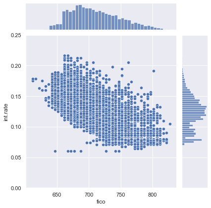

# Lending Club Decision Tree & Random Forest

Can we predict if loans will be fully paid or not? 
In this example, I'm using data from lending club (https://en.wikipedia.org/wiki/LendingClub).
I'm using sciKitlearn Decision Tree and Random Forest algorithms to create a model to predict the likelihood of someone defaulting on their loan (not paying it in full).

# Exploratory Data Analysis

## How does one's FICO score correlates with their credit policy being accepted or not?



## How does one's FICO score correlates with their likelihood to fully repay the loan?



## What are the categories which borrowers are more likely to default?



## What is the correlation between one's FICO score and their interest rate?



# Working on the model

Here I'm using y as the category I'm trying to predict ("Not fully paid") and X is the dataset used to train the model (everything else).

The model will be trained with the X array, which we'll compare to the y array to evaluate the model at the end.

To train the model, I've used the DecisionTreeClassifier() **and** RandomForestClassifier methods from the SciKitLearn library.

# And what now?
Our model is already trained.
If you want to predict if a you just have to call their row under the predict function. You can do as such:

```
row_to_predict = *write down the row # here*
print(dtree.predict(X.iloc[[row_to_predict]]))
```

## Libraries Used

| Name | Library |
| ------ | ------ |
| Pandas | https://pandas.pydata.org/ |
| Matplotlib | https://matplotlib.org/ |
| Seaborn | https://seaborn.pydata.org/ |
| SciKitLearn | https://scikit-learn.org/stable/ |

## More info on methods

| Method | Info |
| ------ | ------ |
| Decision Trees | https://towardsdatascience.com/how-to-explain-decision-trees-predictions-7a10834fe54d |
| Random Forests | https://towardsdatascience.com/understanding-random-forest-58381e0602d2 |